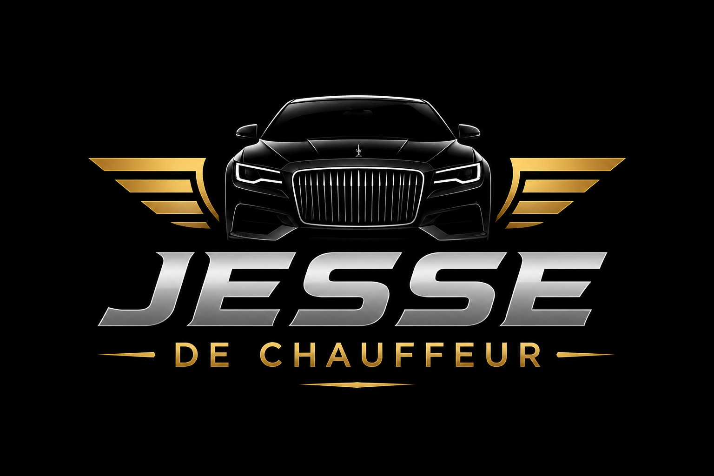
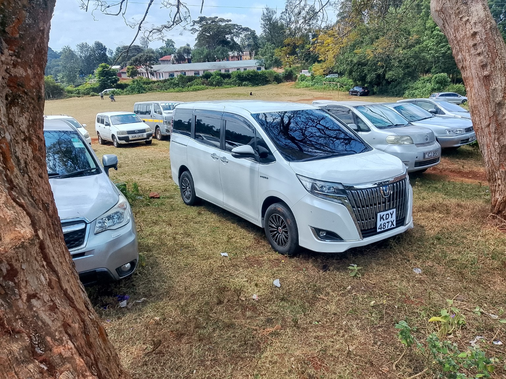

<!DOCTYPE html>
<html lang="en">
<head>
<meta charset="UTF-8">
<meta name="viewport" content="width=device-width, initial-scale=1.0">
<title>Jesse Private Chauffeur | Chauffeur & Airport Transfers in Nanyuki, Kenya</title>
<meta name="description" content="Jesse Private Chauffeur provides reliable chauffeur services in Nanyuki, Kenya, including airport transfers, road trips, corporate travel, local rides and long-distance travel.">
<meta name="robots" content="index, follow">
<link rel="canonical" href="https://jessechauffeur.github.io/">
<meta property="og:type" content="website">
<meta property="og:title" content="Jesse Private Chauffeur | Nanyuki, Kenya">
<meta property="og:description" content="Professional chauffeur services, airport transfers and private rides in Nanyuki, Kenya.">
<meta property="og:url" content="https://jessechauffeur.github.io/">
<meta property="og:image" content="https://jessechauffeur.github.io/toyota-noah-kdy-487x.jpg">
<meta name="twitter:card" content="summary_large_image">
<meta name="twitter:title" content="Jesse Private Chauffeur | Nanyuki, Kenya">
<meta name="twitter:description" content="Professional chauffeur services and airport transfers in Nanyuki, Kenya.">
<meta name="twitter:image" content="https://jessechauffeur.github.io/toyota-noah-kdy-487x.jpg">

<link rel="manifest" href="manifest.webmanifest">
<meta name="theme-color" content="#0a0a0a">
<meta name="mobile-web-app-capable" content="yes">
<meta name="apple-mobile-web-app-capable" content="yes">
<meta name="apple-mobile-web-app-status-bar-style" content="black-translucent">
<meta name="apple-mobile-web-app-title" content="JESSE CHAUFFEUR">
<link rel="apple-touch-icon" href="icons/icon-192.png">

</head>
<body>

  Install JESSE app
  <button id="installAppBtn" style="display:none;border:0;border-radius:999px;padding:9px 14px;background:#c9a227;color:#111;font-weight:700;cursor:pointer;" onclick="installJesseApp()">Install</button>

<header>
  

    
    <nav class="nav" aria-label="Main navigation">
      <a href="#home">Home</a><a href="#services">Services</a><a href="#fleet">Fleet</a>
      <a href="#about">About</a><a href="#faq">FAQ</a><a href="#testimonials">Reviews</a><a href="#location">Location</a><a href="#booking">Book a Ride</a><a href="#contact">Contact</a>
    </nav>
    <a class="whatsapp" href="https://wa.me/254790893508" target="_blank" rel="noopener">WhatsApp 0790893508</a>
  

</header>

<main>
<section id="home" class="hero">
  

    
Trusted local chauffeur

    <h1>JESSE</h1>
    <h2>PRIVATE CHAUFFEUR</h2>
    
<strong>Professional chauffeur services in Nanyuki, Kenya.</strong> From airport pickups and business trips to family travel and road journeys, we make every ride smooth, punctual and comfortable.

    <ul class="hero-list">
      <li>Airport transfers</li>
      <li>Long-distance travel</li>
      <li>Reliable local transport</li>
      <li>Family and group rides</li>
    </ul>
    

      <a class="btn primary" href="#booking">BOOK YOUR RIDE</a>
      <a class="btn secondary" href="https://wa.me/254790893508?text=Hello%20Jesse%20Private%20Chauffeur%2C%20I%20would%20like%20to%20book%20a%20ride." target="_blank" rel="noopener">WHATSAPP US</a>
    

  

</section>

<section id="services">
  <h2 class="section-title">OUR SERVICES</h2>
  
Comfort, punctuality and a stress-free travel experience for every journey.

  

    

✈️
<h3>Airport Transfers</h3>
Pre-booked pickups and drop-offs for a smooth arrival or departure.

    

🛣️
<h3>Long-Distance Travel</h3>
Comfortable chauffeur-driven trips across Kenya and beyond the city.

    

🌄
<h3>Road Trips</h3>
Enjoy the drive while we handle the route, timing and route planning.

    

🏙️
<h3>Local & City Rides</h3>
Professional transport for errands, appointments and daily movement.

    

💼
<h3>Corporate Travel</h3>
Dependable and polished service for executives, teams and visitors.

    

👨‍👩‍👧‍👦
<h3>Group Travel</h3>
Comfortable transportation for families, small groups and special trips.

    

🎓
<h3>School Runs</h3>
Safe and punctual transport for school and family routines.

    

🕐
<h3>24/7 Availability</h3>
Flexible planning for early-morning, late-night and emergency rides.

  

</section>

<section id="about" class="dark">
  

    

      <h2 class="section-title" style="text-align:left;">ABOUT JESSE PRIVATE CHAUFFEUR</h2>
      
Jesse Private Chauffeur provides reliable, comfortable and professional chauffeur services in Nanyuki, Kenya. Whether you need a transfer, a route across town or a longer journey, we focus on safe driving, clear communication and a professional experience from pickup to drop-off.

      <ul class="checks" style="margin-top:20px;">
        <li>Professional and experienced chauffeur</li>
        <li>Punctuality and reliability</li>
        <li>Safe, clean and comfortable travel</li>
        <li>Local knowledge and dependable planning</li>
        <li>24/7 availability for planned or urgent trips</li>
      </ul>
    

    

  

</section>

<section id="fleet">
  <h2 class="section-title">OUR FEATURED VEHICLE</h2>
  
A clean and spacious option for local transfers, family travel and airport runs.

  

    

      

        <h3 style="margin:0 0 10px;font-size:2rem;">Toyota Noah</h3>
        
<strong>Registration:</strong> KDY 487X

        
<strong>Capacity:</strong> 7 seats

        
<strong>Best for:</strong> Airport transfers, family moves, city travel and group rides.

      

    

    

  

</section>

<section class="dark">
  

    

      <h2 class="section-title" style="text-align:left;">ARRIVING IN KENYA?</h2>
      
Let us handle the first part of your trip. Pre-book your airport transfer and travel directly to your destination with comfort and confidence.

      

        <a class="btn primary" href="#booking">BOOK AIRPORT TRANSFER</a>
      

    

    

  

</section>

<section id="faq" style="padding:60px 20px;background:#f7f7f7;">
  

    <h2 class="section-title">FREQUENTLY ASKED QUESTIONS</h2>
    
Quick answers before you book your ride.

    

      

        
Where is Jesse Private Chauffeur located?

        
We are based in Nanyuki, Kenya, at Mariakani Road / Market Road Junction. The location is also available on the map section below.

      

      

        
How do I book a ride?

        
Use the booking form below or send a direct message on WhatsApp. We will confirm the trip and arrange the details with you.

      

      

        
Do you offer airport transfers?

        
Yes. Airport pickups and drop-offs can be pre-booked so your chauffeur is ready at the right time.

      

      

        
Do you provide long-distance and road-trip services?

        
Yes. We provide chauffeur-driven long-distance travel and road trips across Kenya.

      

      

        
What vehicle is available?

        
Our featured vehicle is the Toyota Noah, a 7-seater model suited to airport trips, family rides and group travel.

      

      

        
Are you available 24/7?

        
Yes. We are available around the clock and recommend booking in advance for early or late rides.

      

      

        
Can guests from outside Kenya arrange transport in advance?

        
Yes. Visitors and customers outside Kenya can contact us by WhatsApp or email to arrange travel ahead of arrival.

      

      

        
How can I contact Jesse Private Chauffeur?

        
Call or WhatsApp 0790893508, or email jeyckim47@gmail.com.

      

    

  

</section>

<section id="testimonials" style="padding:60px 20px;background:#fff;">
  

    <h2 class="section-title">CUSTOMER REVIEWS</h2>
    
We are building our review collection. Share your experience and help future customers travel with confidence.

    

      
💬

      <h3 style="margin-bottom:12px;">Your feedback matters</h3>
      
If you have travelled with Jesse Private Chauffeur, we would love to hear how the service felt for you. Your honest review helps future travellers understand what to expect.

      

        <a class="btn primary" href="https://wa.me/254790893508?text=Hello%20Jesse%20Private%20Chauffeur%2C%20I%20would%20like%20to%20share%20a%20review." target="_blank" rel="noopener">SEND YOUR REVIEW</a>
      

    

  

</section>

<section id="location" class="dark" style="padding:60px 20px;">
  

    <h2 class="section-title">FIND JESSE PRIVATE CHAUFFEUR</h2>
    
📍 Mariakani Road / Market Road Junction, Nanyuki, Kenya

    

      <iframe src="https://www.google.com/maps?q=0.0125380,37.0751811&z=18&output=embed" width="100%" height="380" style="border:0;" allowfullscreen="" loading="lazy" referrerpolicy="no-referrer-when-downgrade" title="Jesse Private Chauffeur exact location"></iframe>
    

    

      <a class="btn primary" href="https://www.google.com/maps/dir/?api=1&destination=0.0125380,37.0751811" target="_blank" rel="noopener">📍 GET DIRECTIONS ON GOOGLE MAPS</a>
    

  

</section>

<section id="booking" class="dark">
  <h2 class="section-title">BOOK A RIDE</h2>
  
Tell us about your journey and we'll get back to you.

  <form class="booking" onsubmit="sendBooking(event)">
    

      <input id="name" required placeholder="Full Name">
      <input id="phone" required placeholder="Phone / WhatsApp">
      <input id="email" type="email" placeholder="Email">
      <input id="pickup" required placeholder="Pickup Location">
      <input id="destination" required placeholder="Destination">
      <input id="date" type="date" required>
      <input id="time" type="time" required>
      <input id="passengers" type="number" min="1" required placeholder="Number of Passengers">
      <select id="service" required>
        <option value="" disabled selected>Select Service Required</option>
        <option>Airport Transfer</option>
        <option>Long-Distance Trip</option>
        <option>Road Trip</option>
        <option>Local & City Ride</option>
        <option>Corporate Travel</option>
        <option>Group Travel</option>
      </select>
      <select id="payment" class="full" required>
        <option value="" disabled selected>Select Payment Preference</option>
        <option>Pay after booking confirmation</option>
        <option>M-Pesa (after confirmation)</option>
        <option>Bank transfer</option>
        <option>Cash on pickup</option>
      </select>
      <textarea id="message" class="full" placeholder="Additional details"></textarea>
      
Payment is arranged securely after your booking is confirmed. Never enter your M-Pesa PIN or card details here.

    

    <button class="btn primary submit" type="submit">SEND BOOKING REQUEST</button>
  </form>
</section>

<section id="contact" class="contact">
  

    

      <h2>CONTACT US</h2>
      
📱 Call / WhatsApp: <a href="tel:+254790893508">0790893508</a>

      
📧 Email: <a href="mailto:jeyckim47@gmail.com">jeyckim47@gmail.com</a>

      
📍 Nanyuki, Kenya

    

    

      <h2>JESSE PRIVATE CHAUFFEUR</h2>
      
<em>Smooth rides. Fresh beginnings.</em>

      <a class="btn primary" href="https://wa.me/254790893508" target="_blank" rel="noopener">CHAT ON WHATSAPP</a>
    

  

</section>
</main>

<section class="socials" aria-label="Follow Jesse Private Chauffeur">
  <h2>FOLLOW JESSE PRIVATE CHAUFFEUR</h2>
  
Connect with us and stay updated.

  

    <a href="https://www.tiktok.com/@jeyckim" target="_blank" rel="noopener" style="background:#111;">TikTok</a>
    <a href="https://www.facebook.com/profile.php?id=100054334628916" target="_blank" rel="noopener" style="background:#1877F2;">Facebook</a>
    <a href="https://wa.me/254790893508" target="_blank" rel="noopener" style="background:#25D366;">WhatsApp</a>
    <a href="mailto:jeyckim47@gmail.com" style="background:#555;">Email</a>
  

</section>

<footer>© 2026 Jesse Private Chauffeur. All rights reserved. • Nanyuki, Kenya</footer>

  <a href="tel:+254790893508" aria-label="Call Jesse Private Chauffeur" style="display:flex;align-items:center;justify-content:center;padding:12px 16px;border-radius:999px;text-decoration:none;background:#111;color:#fff;font-weight:700;box-shadow:0 8px 24px rgba(0,0,0,.25);">📞 Call</a>
  <a href="https://wa.me/254790893508?text=Hello%20Jesse%20Private%20Chauffeur%2C%20I%20would%20like%20to%20make%20a%20booking." target="_blank" rel="noopener" aria-label="WhatsApp Jesse Private Chauffeur" style="display:flex;align-items:center;justify-content:center;padding:12px 16px;border-radius:999px;text-decoration:none;background:#25D366;color:#fff;font-weight:700;box-shadow:0 8px 24px rgba(0,0,0,.25);">💬 WhatsApp</a>

</body>
</html>
